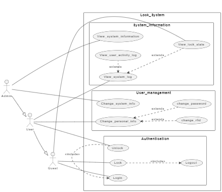
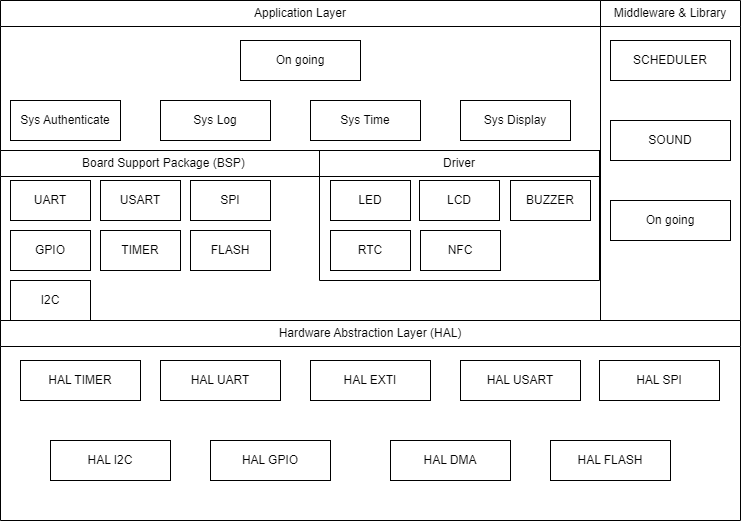

# Domain Context
Nowadays, Smart Door Locks are integrated completely in many apartments due to the convenience and the safety brought to people by it. Each household doesn’t need to use the manual locks which is bulky and vulnerable. Traditional lock is broken easily by mechanical tools, whereas the smart lock hide its actuator for locking inside the door and therefor, it’s hard to pry open the door. Manual lock always needs to go together with a key, that will lead to the risk of losing and we must keep a spare one somewhere else, which make the manual lock even more unfavorable. Smart lock offer more advantageous options which will be described in bellow.

# Detailed features

## Functional Requirement
### Must have
The Smart Door Locks will provide all the following features, user can choose either method to open the door:
- The Lock operates in two modes, RFID mode and Password mode:
    + In RFID mode, the lock will open if it sense the correct tag. 
    + In Password mode, the lock will open when user enter the right password. 
- The Lock allows user to set up new password. It will become valid right after the setting complete. 
- The Lock also support user with setting up new RFID card in case the old one is lost.
- The Lock provides user hierarchy include two levels of user which are admin and household:
    + Admin’s rights consist of accessing to history information of door status, accessing to household information, opening the door independent of household’s password, setting up new household’s information. 
    + Household’s rights include opening the door with password or RFID tag, setting up new password, setting up new RFID, view history of door status.
- The Lock will start sound alarm when user enter correct/wrong password or swipe a card. 
- The Lock must allow admin to connect to application to manage all information of Lock system.
- At normal time, the LCD will be off. When user touching the keypad, LCD will be active and display the following options:
    + Enter password:
    When user select this option, LCD will display **Please enter your password** and a line of hyphens. Each time user enter a character, the respective hyphens will be changed to dot.
    + Set new password:
    When user select this option, LCD will display **Please enter your old password** and a line of hyphens. After entering the correct password, LCD will display **Please enter your new password** and a line of hyphens. At this time, user will enter the new password that user want to set. The password will become valid after pressing enter key.
    + Access household information:
    When user select this option, LCD will display **Please enter authentic ID** and a line of hyphens. After entering the correct ID, PC will send command to start receiving household information and display on GUI.
    + Set new household information:
    When user select this option, LCD will display **Please enter authentic ID** and a line of hyphens. After entering the correct ID, PC will send command to update the new information entered from GUI.
    + Access logging information:
    When user select this option, LCD will display **Please enter authentic ID** and a line of hyphens. After entering the correct ID, PC will send command to start receiving logging information and display on GUI.

### Should have
- The Lock should start alarm sound when user enter or swipe wrong password/card more than 3 times (threshold).
- The Lock should start successful sound when user complete changing password/card.

### Nice to have 
- The lock is nice to have mechanism for admin to add new function or remove old function to Lock system through application. 

## Non-functional Requirement

### Must have
- The length of user's password is at least 8 characters which is then encrypted (eg: bencode, hash).
- The Lock allow user enter wrong password or wrong RFID at most 3 times. After user fail at entering password or RFID tag at fourth time, the Lock will enter Double Locked state in 5 minutes.
- The Lock can detect the state of the door is locked or opened. If it is left opened for more than 5 seconds, the lock will automatically enter locked state.
- The logging mechanism of the lock will store the information of accessing time, the state of the Lock, the user accessing the lock at the time the user presents RFID tag or enters password.
- The Lock log the information starting from 20 days before present day. After each day, the system will delete the information on the oldest day.
- When user have no more action on keypad for more than 20 seconds, LCD display will be off.

### Should have

### Nice to have

## Usecase diagram
 

## Block diagram for pin connection:

## Required Modules
| Module                   | Functionality                                     |
| -------------------------| ------------------------------------------------- |
| STM32F411VE              | Main microcontroller for the system               |
| RFID NFC 13.56MHz RC522  | User can unlock system by using key tags          |
| TTP229 Touch Keypad      | Allows users to enter password                    |
| PL2102                   | Transmit data between GUI and system              |
| OLED LCD 0.96 inch       | Display information according to functions        |
| Buzzer                   | Alerts users if the password is correct or not    |
| RGB Led                  | Status indicator lights for the door              |
| RTC DS1307               | Real-time clock module for timekeeping            |
| IR Infrared Obstacle Avoidance | Detect Obstacle            |

## Technologies
| Module                   |        |
| -------------------------| -------|
| RFID NFC 13.56MHz RC522  | SPI    |
| TTP229 Touch Keypad      | GPIO   |
| PL2102                   | UART   |
| OLED LCD 0.96 inch       | I2C    |
| Buzzer                   | PWM    |
| RGB Led                  | PWM    |
| RTC DS1307               | I2C    |
| IR Infrared Obstacle Avoidance | GPIO |

## Firmware Architecture
 

# Project Timeline 

<!-- add timeline here -->