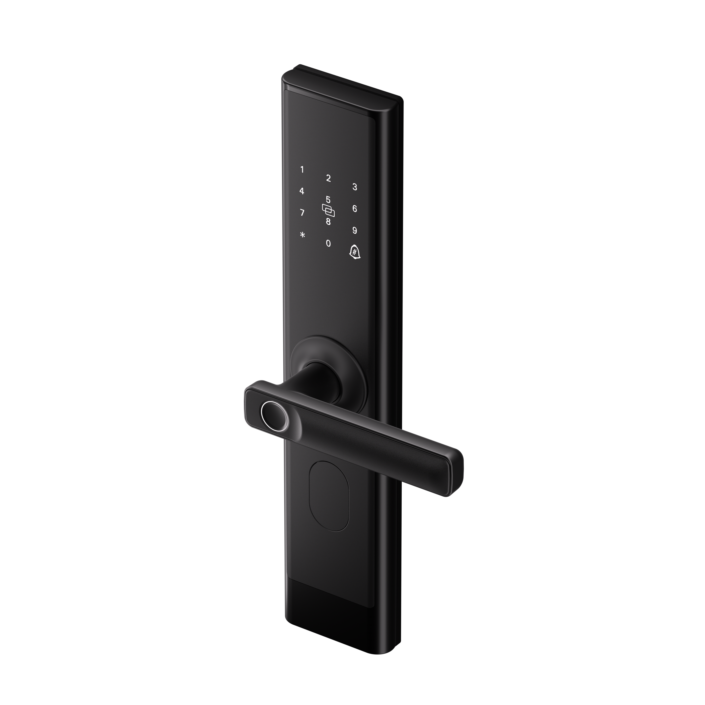

# SMART DOOR LOCK

## Features
The SmartDeskClock project includes the following features:

## Required Modules
| Module                   | Functionality                                     |
| -------------------------| ------------------------------------------------- |
| STM32F411VE              | Main microcontroller for the system               |
| RFID NFC 13.56MHz RC522  | User can unlock system by using key tags          |
| TTP229 Touch Keypad      | Allows users to enter password                    |
| PL2102                   | Transmit data between GUI and system              |
| OLED LCD 0.96 inch       | Display information according to functions        |
| Buzzer                   | Alerts users if the password is correct or not    |
| RGB Led                  | Status indicator lights for the door              |
| RTC DS1307               | Real-time clock module for timekeeping            |

## Technologies
| Module                   |        |
| -------------------------| -------|
| RFID NFC 13.56MHz RC522  | SPI    |
| TTP229 Touch Keypad      | GPIO   |
| PL2102                   | UART   |
| OLED LCD 0.96 inch       | I2C    |
| Buzzer                   | PWM    |
| RGB Led                  | PWM    |
| RTC DS1307               | I2C    |

## Developer team
1. **Phạm Đức Minh**
2. **Nguyễn Nhật Hưng**
3. **Nguyễn Tấn Phát**
